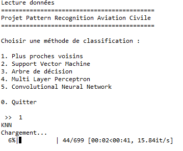
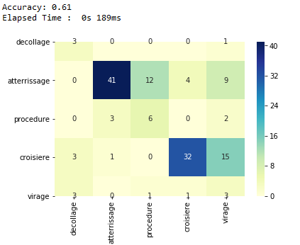

# Projet2A

Pour utiliser le projet il est nécessaire d'avoir la librairie <b>Tensorflow 2</b> d'installé :

```
pip install tensorflow
```

Et d'utiliser un éditeur comme **spyder** avec la configuration fournie par **Anaconda** pour exécuter les scripts


## Utilisation 

1. Les données étant trop volumineuses pour être déposées sur le git elles se trouvent dans un fichier **CSV** disponible à cette adresse : https://www.dropbox.com/s/cicsywbkt421koa/states_2019-12-23-00.csv?dl=0

   

      La signification de chaque variable est expliquée [ici](data/README.txt)

   

2. Il faut déjà nettoyer et mettre en forme les données ( uniformisation des vols) à l'aide d'un script ( l'opération peut prendre beaucoup de temps car le fichier de vols labélisés contient 700 vols, le fichier de sortie est déjà pré-généré dans le répertoire **data** ), cette opération est faite automatiquement si le fichier **scalledValues.csv** n'est pas trouvé dans le répertoire **data**

   

3. Il est possible de choisir l'algorithme de classification à utiliser grâce à un menu lors de l'exécution du fichier **final_project.py**

   

   


## Résultat 

   

   Voici un exemple de résultat pour l'exécution d'un des algorithmes mis en place


​    

